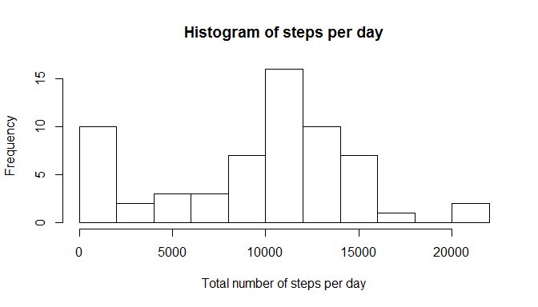
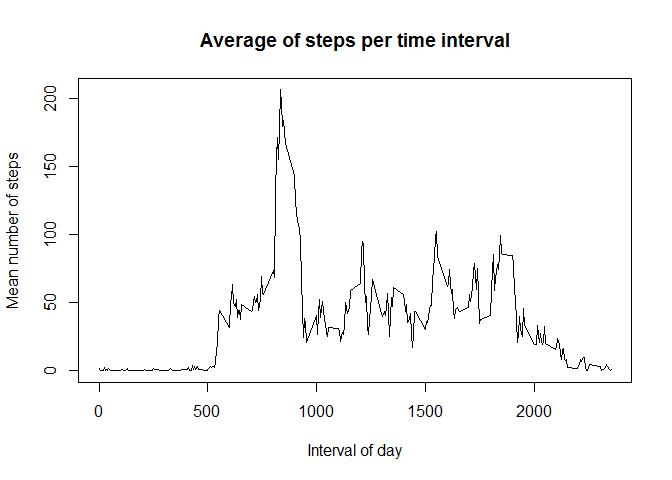
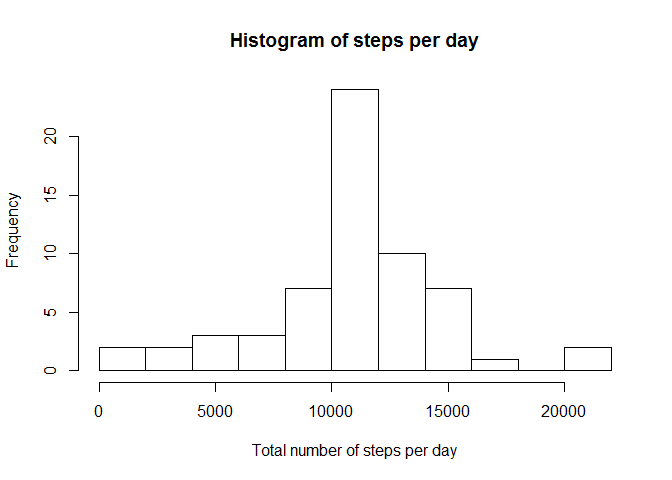
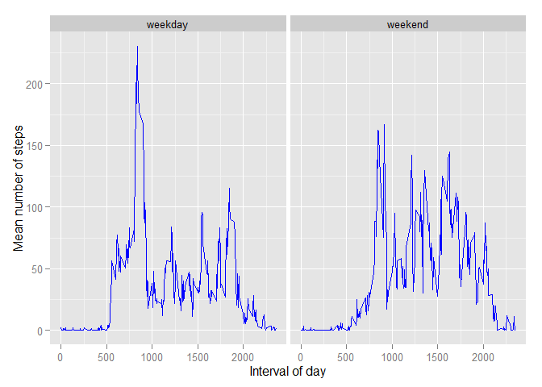

# Reproducible Research: Peer Assessment 1

This is my report for the first home assignment in "Reproducible Research".

## Loading and preprocessing the data
In a first step, the zipped data is unzipped into a subdirectory called "data". Then, it is loaded into the workspace
and stored as a data.table.


```r
library(data.table)
unzip(zipfile = 'activity.zip', exdir = './data')
activity_data <- fread('./data/activity.csv', colClasses = c('integer', 'date', 'integer'))
```
The date column is converted into date format:

```r
activity_data$date <- as.Date(activity_data$date, format = "%Y-%m-%d")
head(activity_data)
```

```
##    steps       date interval
## 1:    NA 2012-10-01        0
## 2:    NA 2012-10-01        5
## 3:    NA 2012-10-01       10
## 4:    NA 2012-10-01       15
## 5:    NA 2012-10-01       20
## 6:    NA 2012-10-01       25
```


## What is mean total number of steps taken per day?
To answer this question, the data has to be aggregated per day:


```r
agg_data_day <- activity_data[,list(steps_per_day = sum(steps, na.rm = TRUE)), by=date]
mean = mean(agg_data_day$steps_per_day, na.rm = TRUE)
median = median(agg_data_day$steps_per_day, na.rm = TRUE)
head(agg_data_day)
```

```
##          date steps_per_day
## 1: 2012-10-01             0
## 2: 2012-10-02           126
## 3: 2012-10-03         11352
## 4: 2012-10-04         12116
## 5: 2012-10-05         13294
## 6: 2012-10-06         15420
```

**Median** of the total number of steps is **10395** and **mean** is **9354.2295082**. The following histogram shows the frequency of total steps per day over the considered period:


```r
hist(agg_data_day$steps_per_day, breaks = 10, main = "Histogram of steps per day", 
     xlab = "Total number of steps per day")
```

\


## What is the average daily activity pattern?

Reaggregate the data to get the average number of steps per time interval:


```r
agg_data_timestep <- activity_data[,list(avg_steps_per_time = mean(steps, na.rm = TRUE)), by=interval]
plot(agg_data_timestep$interval, agg_data_timestep$avg_steps_per_time, type = "l",
     xlab = "Interval of day", ylab = "Mean number of steps", 
     main = "Average of steps per time interval")
```

\

```r
agg_data_timestep <- agg_data_timestep[order(-avg_steps_per_time)]
max_interval <- agg_data_timestep[1]
```

The interval with the most steps on average is **interval 835** with
an **average number of steps of 206.1698113.**


## Imputing missing values
First, calculate the number of rows with NAs:


```r
nas <- is.na.data.frame(activity_data)
print(summary(nas))
```

```
##    steps            date          interval      
##  Mode :logical   Mode :logical   Mode :logical  
##  FALSE:15264     FALSE:17568     FALSE:17568    
##  TRUE :2304      NA's :0         NA's :0        
##  NA's :0
```

As indicated above, the only column with missing values is the "steps" column. As a strategy to impute missing
values, I therefore choose to replace the NAs by the corresponding average values of that time interval over 
all days.


```r
activity_data_cleaned <- merge(activity_data, agg_data_timestep, by="interval")
activity_data_cleaned <- activity_data_cleaned[,steps_cleaned:=ifelse(is.na(steps),avg_steps_per_time, steps)]
activity_data_cleaned <- activity_data_cleaned[,`:=`(steps=NULL, avg_steps_per_time=NULL)]
agg_data_day_cleaned <- activity_data_cleaned[,list(steps_per_day = sum(steps_cleaned)), by=date]
mean_cleaned = mean(agg_data_day_cleaned$steps_per_day)
median_cleaned = median(agg_data_day_cleaned$steps_per_day)
head(agg_data_day_cleaned)
```

```
##          date steps_per_day
## 1: 2012-10-01      10766.19
## 2: 2012-10-02        126.00
## 3: 2012-10-03      11352.00
## 4: 2012-10-04      12116.00
## 5: 2012-10-05      13294.00
## 6: 2012-10-06      15420.00
```

The **median** of the cleaned steps per day is now **1.0766189\times 10^{4}** and the **mean** is **1.0766189\times 10^{4}**. 
Apparently, the pre-processing by imputing missing values has a significant impact on the estimates of total daily
number of steps as this histogram shows in comparison to the one above:


```r
hist(agg_data_day_cleaned$steps_per_day, breaks = 10, main = "Histogram of steps per day",
     xlab = "Total number of steps per day")
```

\


## Are there differences in activity patterns between weekdays and weekends?

To answer this question, a new variable "day_type" is created

```r
activity_data_cleaned <- activity_data_cleaned[,day_type:=as.factor(ifelse(weekdays(date) %in% c("Samstag", "Sonntag"),"weekend","weekday"))]
head(activity_data_cleaned)
```

```
##    interval       date steps_cleaned day_type
## 1:        0 2012-10-01      1.716981  weekday
## 2:        0 2012-10-02      0.000000  weekday
## 3:        0 2012-10-03      0.000000  weekday
## 4:        0 2012-10-04     47.000000  weekday
## 5:        0 2012-10-05      0.000000  weekday
## 6:        0 2012-10-06      0.000000  weekend
```


```r
library(ggplot2)
agg_data_timestep_daytype <- activity_data_cleaned[,list(avg_steps_per_time = mean(steps_cleaned, na.rm = TRUE)), by=list(interval, day_type)]
g <- ggplot(agg_data_timestep_daytype, aes(interval, avg_steps_per_time)) +
        geom_line(colour = "blue") + 
        facet_wrap(~day_type) + 
        labs(x = "Interval of day", y = "Mean number of steps")
g
```

\

Obviously, activity patterns differ depending on whether a weekday or weekend is considered. 
